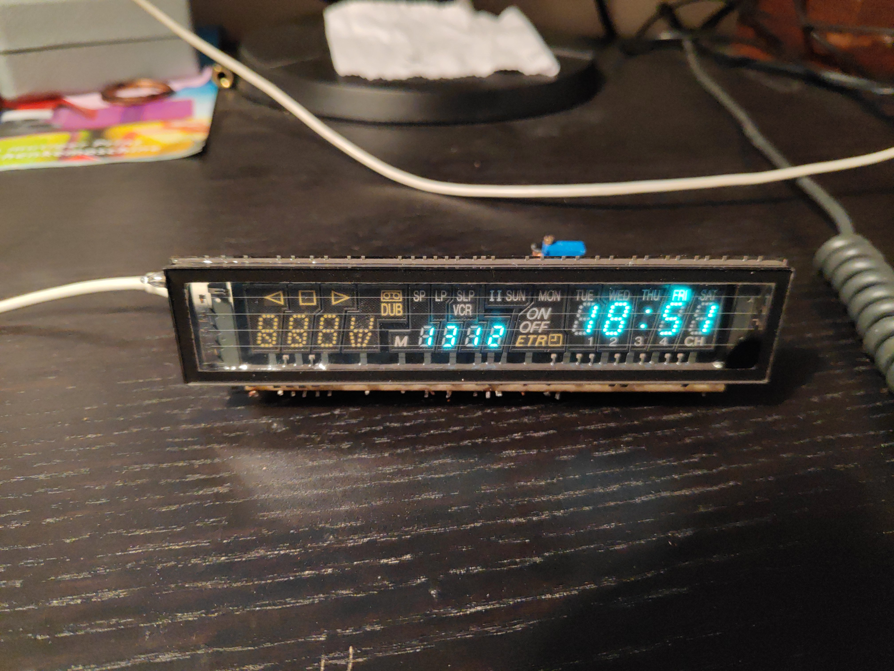

# Using a ESP8266 to show time and date on a VFD.



Because delay() is not very accurate, the time is synchronized by NTP every hour.

The MAX6921 is driven by 3.3V Logic and 12V for the grids / anodes.

(!) The wiring is very specific to this particular display, but the principle is the same. This is how i chose the pins on the MAX6921.

Example:
``` c
/* Pin No                26 25 24 23 22 21 20 19 18 17 12 11 10  9  8  7  6  5  4  3 */
int hourTens[20]      = { 0, 0, 0, 0, 0, 0, 0, 0, 1, 0, 0, 0, 0, 0, 0, 0, 0, 0, 0, 0};
```
which means: the pin 18 is responsible for the hours tens digit 

``` c
                         26 25 24 23 22 21 20 19 18 17 12 11 10  9  8  7  6  5  4  3 */
                        { 0, 0, 0, 0, 0, 0, 0, 0, 0, 1, 0, 0, 1, 1, 0, 1, 0, 1, 0, 1},//0
```
for displaying a 0, the pins 17, 10, 9, 7, 11, 3 are ON.
``` c

This is the 7 segment digit:
/*
  10
17  09
  19
03  07
  11
*/
```
